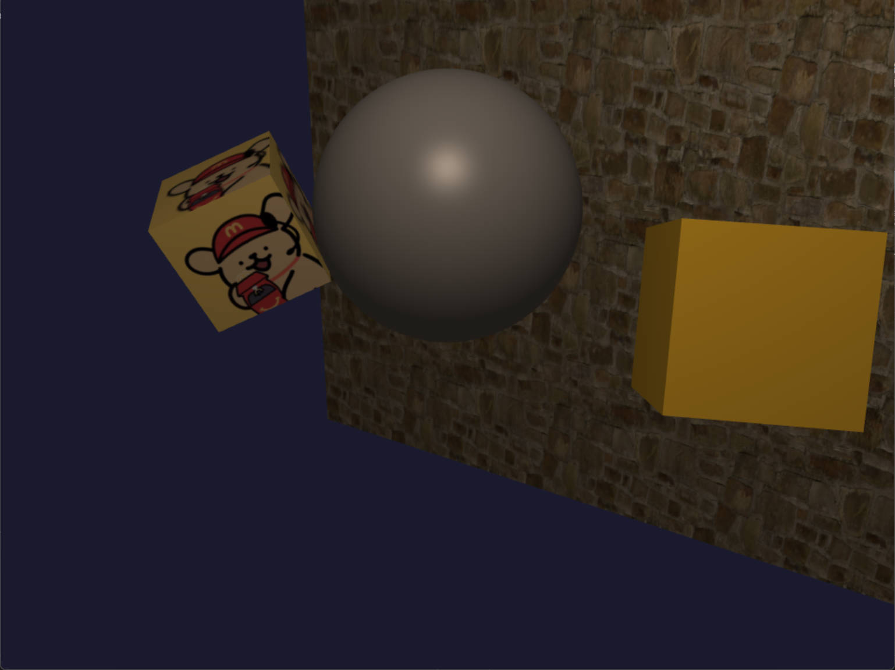
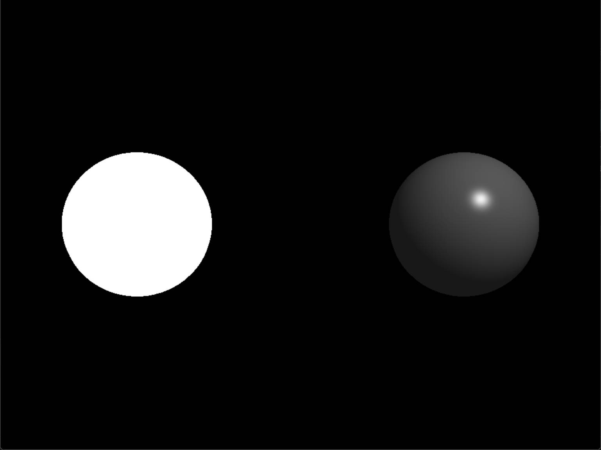
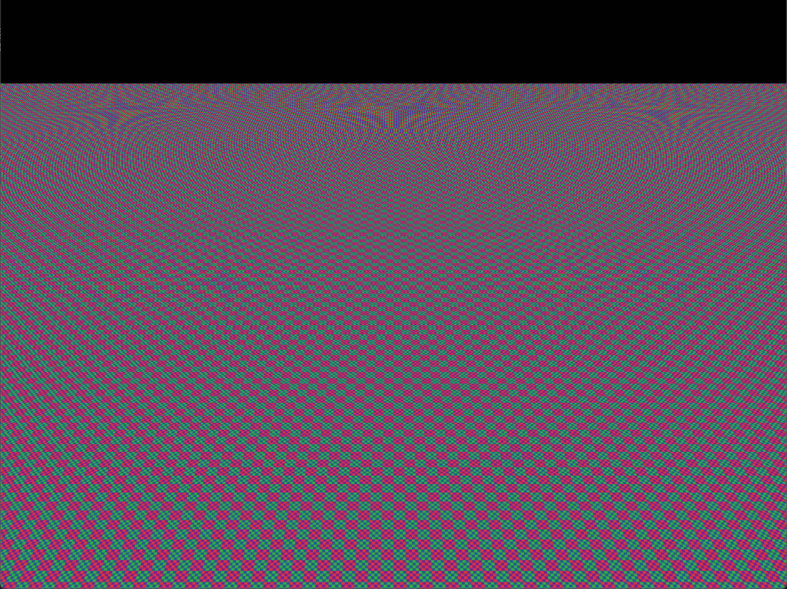
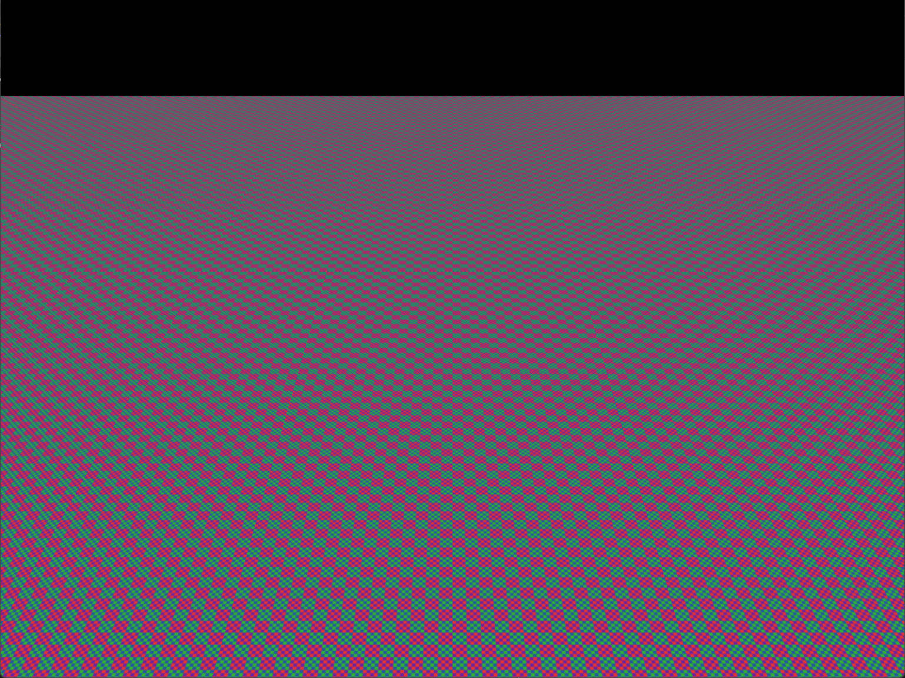
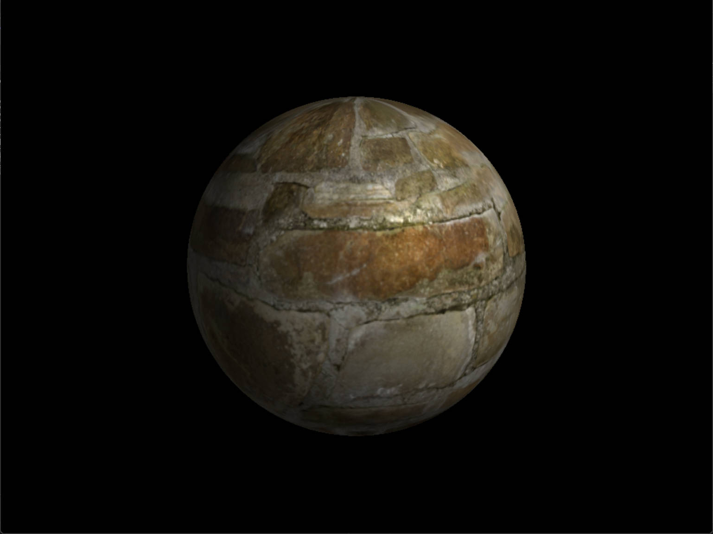
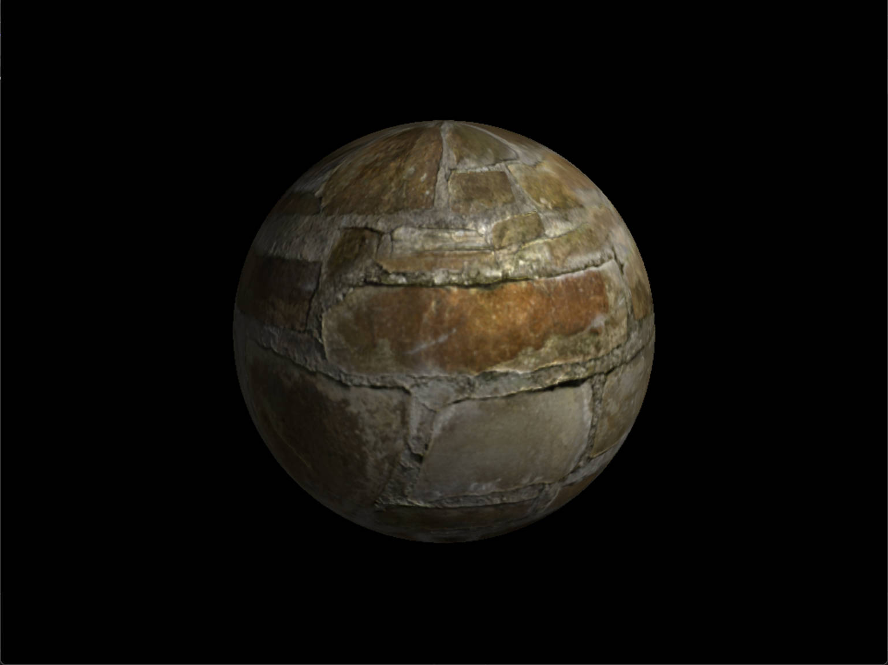

# Puppy · 小狗

一个从零实现的 CPU 软光栅渲染器，用于深入理解 3D 图形管线的底层原理。支持完整的 MVP 变换、透视校正插值、纹理映射、法线贴图、多重采样抗锯齿（MSAA）以及可扩展的着色器框架。

  

  <b>渲染效果预览</b>

## ✨ 核心特性

- **完整渲染管线**
  - 模型（Model）、视图（View）、投影（Projection）矩阵变换
  - 透视除法、视口映射、基于重心坐标的逐像素光栅化
  - 背面剔除（Back-Face Culling）与深度测试（Depth Test）
  - **透视校正插值**（Perspective-Correct Interpolation），避免纹理扭曲

- **着色器框架（Shader System）**
  - 抽象 `Shader` 基类，支持顶点/片元着色器自定义
  - 内置实现：`SimpleShader`（纯色）、`TextureShader`（纹理）、`PhongShader`（Blinn-Phong 光照）
  - **`NormalMappingShader`**：支持 4 种法线计算模式（顶点法线 / 法线贴图 / 高度图实时推导 / 混合）

  

  <b>无光照 与 Blinn-Phong 光照对比</b>

- **纹理与 Mipmap**
  - 双线性（Bilinear）与三线性（Trilinear）纹理过滤
  - 基于盒式滤波（Box Filter）自动生成 Mipmap 链
  - 利用屏幕空间纹理坐标梯度（`dTdx`, `dTdy`）动态计算 LOD（细节层次），有效抑制远处走样

<!-- Mipmap 对比 -->

  
    
    <b>Mipmap：关</b>
  
  
    
    <b>Mipmap：开</b>
  

- **法线贴图与切线空间**
  - 构建 TBN 矩阵，将切线空间法线转换到世界空间
  - 支持从高度图（Bump Map）实时计算法线（梯度差分法）
  - Gram-Schmidt 正交化确保 TBN 矩阵稳定性

<!-- 法线贴图对比 -->

  
    
    <b>仅顶点法线（无细节）</b>
  
  
    
    <b>法线贴图（细节丰富）</b>
  

- **多重采样抗锯齿（MSAA）**
  - 支持 4x / 8x 采样，采用优化的旋转网格（Rotated Grid）子采样模式
  - 独立采样点深度测试，最终颜色解析（Resolve）平均输出

<!-- MSAA 对比 -->

  
    
    <b>MSAA：关</b>
  
  
    
    <b>MSAA：8x</b>
  

- **交互与控制**
  - 基于 SDL2 的窗口与输入管理
  - **四元数（Quaternion）FPS 相机**：平滑旋转，无万向锁（Gimbal Lock）
  - 鼠标拖拽旋转视角，WASD/QE 六自由度移动

## 🛠️ 构建与运行

项目已集成全部依赖库及构建工具，Windows 下**无需额外下载**。

### 📦 环境依赖

| 依赖项 | 集成位置 | 说明 |
| :--- | :--- | :--- |
| **C++20** | 编译器支持 | Visual Studio 2022（`/std:c++20`） |
| **SDL2** | ✅ `Puppy/vendor/` | 窗口管理、输入处理、纹理上传（已编译二进制库 + 头文件） |
| **GLM** | ✅ `Puppy/vendor/` | 数学运算库（仅头文件） |
| **STB_Image** | ✅ `Puppy/vendor/` | 纹理图片加载（仅头文件） |
| **Premake5** | ✅ `vendor/` | 跨平台构建工程生成工具（可执行文件） |

> 💡 **平台说明**：项目当前以 **Windows + Visual Studio 2022（C++20）** 为主要开发环境，已在 VS2022 下完整测试通过。所有依赖已针对该平台集成，**克隆即用**。Premake 原生支持生成 `vs2019` / `gmake2` / `xcode4` 等多种工程文件，其他环境可按需配置。

### 🚀 快速开始

1. 进入项目根目录下的 `scripts/` 文件夹。
2. 双击执行 **`GenerateProjects.bat`**（脚本会自动调用 `vendor/premake/bin/premake5.exe vs2022` 生成解决方案）。
3. 返回根目录，打开生成的 `Puppy.sln` 解决方案文件。
4. 在 Visual Studio 中按 `F5` 编译并运行。